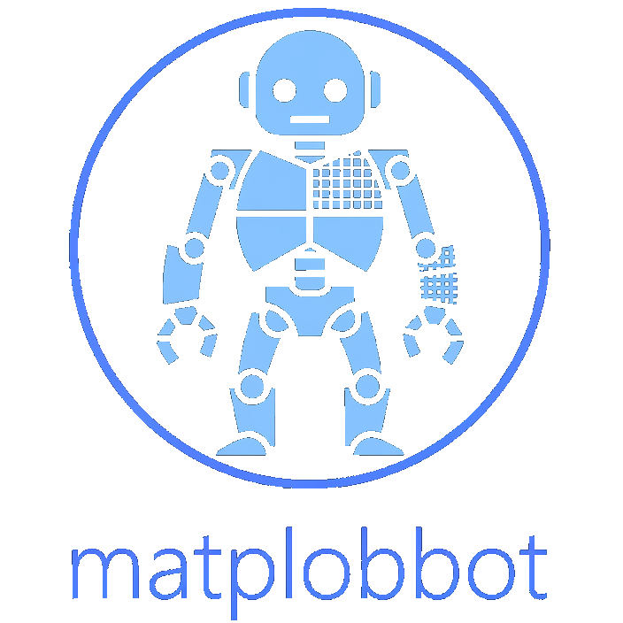
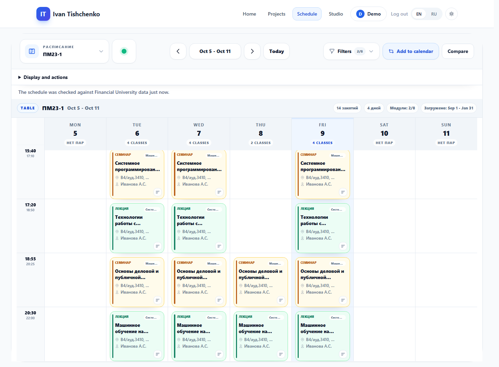
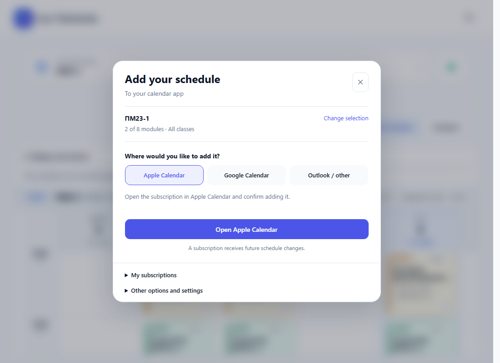
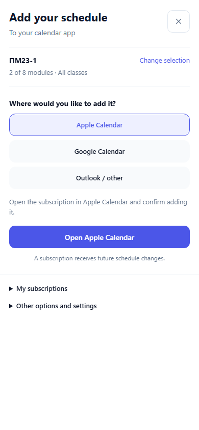
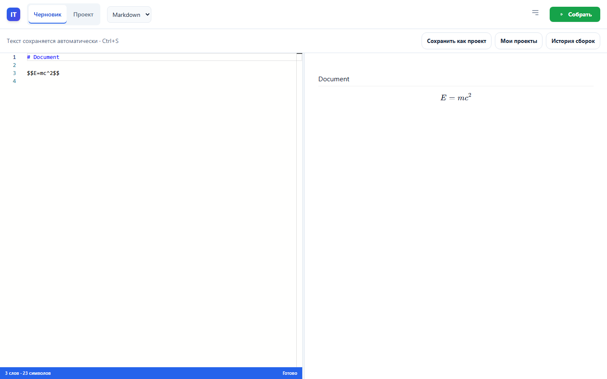
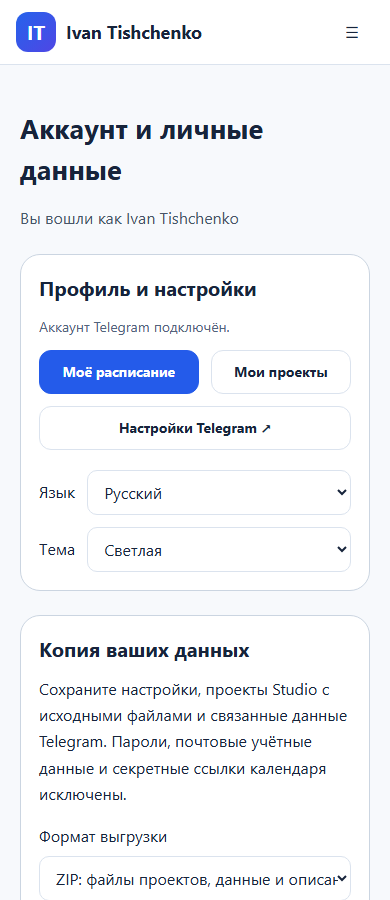
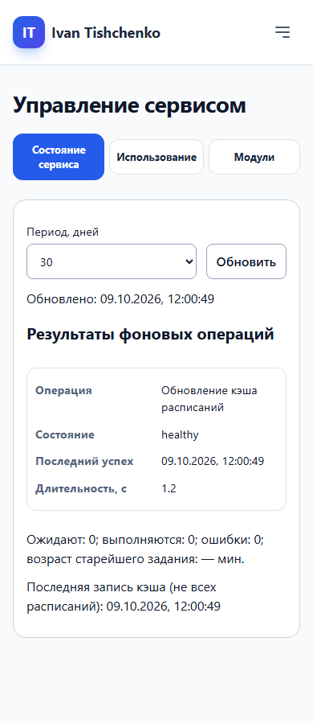

<div align="center">
  
  <h1>Matplobbot</h1>
  <p><a href="README.md">English</a> | <a href="README.ru.md">Русский</a></p>
  <strong>Study materials, university schedules and document creation — in Telegram and on the web.</strong>

  <p align="center">
    
    
    
    
    
  </p>

  <p align="center">
    
  </p>

  <p><a href="https://ivantishchenko.ru/schedule">Schedule</a> · <a href="https://ivantishchenko.ru/studio">Document Studio</a> · <a href="https://github.com/Ackrome/matplobbot">GitHub</a></p>

  <h3>Open in Telegram</h3>
  <p align="center">
    <a href="https://t.me/matplobbot"></a>
    <a href="https://t.me/test_matplobbot"></a>
  </p>
</div>

## Overview

Matplobbot brings study materials, university schedules and document creation into one Telegram bot and web application. Search your notes, compare timetables, subscribe to a calendar, or turn a draft into a PDF without switching between unrelated tools.

The website supports English and Russian, light and dark themes, desktop and mobile layouts, and Telegram Mini Apps. The capabilities below describe the current repository; availability on a deployed instance depends on its version and configuration.

## What you can do

### Schedules and calendars

- Find a group, lecturer or auditorium from Telegram or the website. Use keyboard search, recent entries and favorites, then jump directly to today's classes.
- Filter by modules and class type, switch between day and week views, and open full lesson details.
- Compare up to six schedules across a period of up to 14 days. See overlapping classes and common free windows on a shared timeline. Missing source data is not treated as free time.
- Keep schedule subscriptions in sync between the website and Telegram. Receive daily notifications and alerts about changed, added or cancelled classes.
- Subscribe through a private WebCal/iCalendar link, or download a one-time ICS snapshot. Calendar profiles support different selections and filters.
- Use **Add to calendar** to choose Apple Calendar, Google Calendar or Outlook in a focused dialog. Edit modules and manage saved subscriptions without squeezing the timetable; on mobile, the dialog fills the screen.
- Reopen cached schedules when the upstream source is unavailable, with visible freshness information. The installable web app also caches its interface for offline access.

### Document Studio

- Start with a local LaTeX, Markdown or Mermaid draft, then save its contents as a project after signing in.
- Edit with Monaco, use document and presentation templates with visual previews, manage project files, and rename, copy or delete projects.
- Preview Markdown and diagrams live, compile documents asynchronously, download PDF/PNG results, or send a result to Telegram.
- Recover browser drafts after a reload, compare local and server versions, and download both before choosing which to keep.
- Open a source file and line from a build error. Review recent builds, retrieve results, or cancel a running compilation.
- Upload several files with per-file status and retry failed uploads. Save with `Ctrl/Cmd+S`; build with `Ctrl/Cmd+Enter`.

Drafts and the last 20 build records are stored on the current device. Build results are retained for up to 24 hours; this is recovery support, not permanent version history. Offline access does not include server compilation.

### Telegram materials and tools

- Browse and search `matplobblib` topics and Markdown notes from linked GitHub repositories.
- Search both sources from one screen, save search presets, and keep favorite materials.
- Render LaTeX formulas and Mermaid diagrams to PNG, and convert Markdown to HTML or PDF.
- Manage subscriptions, repositories, language and personal preferences through inline menus.
- Optionally forward mail from private IMAP/POP3 mailboxes to Telegram, with encrypted credentials, per-mailbox controls and delivery retries.

### Account and administration

- Open the account page from your signed-in avatar/name card. Manage language and theme, return to your tools, or jump to Telegram settings.
- Manage saved schedule subscriptions and Telegram notification settings from the account page. Sign out of the current session or all website sessions; revocation survives service restarts.
- Export account data as JSON or as a ZIP containing project sources. Account deletion is separated from everyday actions and requires a recent export and confirmation.
- Administrators have separate views for service health, usage and discipline-to-module mappings, plus user activity pages and CSV export.
- Operational status covers schedule freshness, rendering and notification delivery. Usage includes aggregate workflow timings without document contents or search text.
- Live statistics use WebSockets. If the chart library is unavailable, the underlying data remains available as a table.

## Interface

Schedule and calendar screenshots were refreshed on October 9, 2026, from the current local interface with demonstration data. Other screenshots show the Studio, account and service health views.

### Weekly schedule

Compact lesson cards keep the subject, room and lecturer together while preserving the timetable's time scale.



### Add a calendar subscription

Choose your calendar app and use the main action. The dialog keeps the schedule in place behind a blurred backdrop; module selection, saved subscriptions and other settings are expandable. A subscription receives future schedule changes, while an ICS download is a one-time copy.



On phones, the same flow uses a full-screen sheet:

<p>
  
</p>

### Studio with live Markdown and formulas



### Mobile account and service health

<p>
  
  
</p>

## Run locally

You need Docker with Docker Compose v2 and a Telegram bot token. The service builds use the project's GHCR base images; Docker must be able to pull them.

Server rendering requires the worker's Linux namespace sandbox. On an AppArmor-enabled Docker host, provision the named worker policy and provide the Compose override described in the [release runbook](docs/release-runbook.md#acceptance-and-deployment) before starting the stack. Docker Desktop daemons without AppArmor omit that policy. Rendering fails closed when isolation is unavailable.

### 1. Get the repository and configure the environment

```bash
git clone https://github.com/Ackrome/matplobbot.git
cd matplobbot
cp .env.example .env
```

In PowerShell, use `Copy-Item .env.example .env` for the final command. Edit `.env` before starting containers:

| Variable | Configuration |
| --- | --- |
| `BOT_TOKEN` | Token for your own Telegram bot. |
| `ADMIN_USER_IDS` | Comma-separated Telegram IDs for bot administrators. |
| `POSTGRES_USER`, `POSTGRES_PASSWORD`, `POSTGRES_DB` | Database credentials and database name. |
| `DATABASE_URL` | Required SQLAlchemy URL, using the same credentials; inside Compose the host is `postgres`. URL-encode special characters in credentials. |
| `REDIS_URL` | Inside Compose: `redis://redis:6379/0`. |
| `JWT_SECRET_KEY` | A random secret of at least 32 characters. |
| `STATS_USER`, `STATS_PASS` | A dedicated password administrator and a strong password; create the account in step 3. |
| `PUBLIC_SITE_URL`, `CORS_ALLOWED_ORIGINS` | Keep the template's localhost values for local use; set your public HTTPS origin for deployment. |
| `GITHUB_TOKEN` | A token for GitHub-backed features, when used; remove the example value if unused. |
| `MAIL_CREDENTIAL_KEY` | Leave empty when mail forwarding is unused. Otherwise use a valid Fernet key and keep it stable. |

For local development, keep `ENVIRONMENT=development`. The complete template also documents logging, schedule freshness, notification delivery and operational limits.

### 2. Start the application

```bash
docker compose up --build -d main-site-frontend mpb-fastapi-stats mpb-scheduler
```

Compose starts their bot, worker, database, Redis and migrator dependencies. The migrator applies `alembic upgrade head`. This local command does not start Caddy, whose checked-in configuration uses deployment-specific domains.

If you need to build the base images locally first:

```bash
docker build -f Dockerfile.base-python -t ghcr.io/ackrome/matplobbot-base-python:latest .
docker build -f Dockerfile.base-worker -t ghcr.io/ackrome/matplobbot-base-worker:latest .
```

### 3. Create the password administrator

After the API container and database migrations are ready:

```bash
docker compose exec mpb-fastapi-stats python -m fastapi_stats_app.bootstrap_admin
```

The command reads `STATS_USER` and `STATS_PASS` from the container. It creates a dedicated administrator or updates an existing unlinked administrator; it refuses to overwrite an ordinary or Telegram-linked account. Public login does not create this account automatically. The example username is `matplobbot-deploy`. Jenkins selects it through the `DEPLOY_ADMIN_USERNAME` parameter, with the password in `PROD_STATS_PASS`; the legacy `PROD_STATS_USER` credential is no longer used. If the selected name is already linked to Telegram or belongs to an ordinary account, choose another dedicated name.

On the login page, expand the administrator password form. Telegram sign-in additionally requires a bot/domain configuration appropriate for your deployment; the checked-in frontend points to the project's bot. See [authentication and Mini Apps](docs/wiki.md#auth-and-account-sessions) before configuring your own instance.

### 4. Open the services

| Service | Local address |
| --- | --- |
| Website | [localhost:8080](http://localhost:8080) |
| Schedule | [localhost:8080/schedule](http://localhost:8080/schedule) |
| Studio | [localhost:8080/studio](http://localhost:8080/studio) |
| Account and data | [localhost:8080/account](http://localhost:8080/account) |
| Admin dashboard | [localhost:8080/stats](http://localhost:8080/stats) |
| Interactive API documentation | [localhost:9583/docs](http://localhost:9583/docs) |
| API health | [localhost:9583/api/stats/health](http://localhost:9583/api/stats/health) |
| Scheduler health | [localhost:9584/health](http://localhost:9584/health) |

The frontend proxies `/api/` and `/ws/` to FastAPI. The bot is available in Telegram using the token you configured.

```bash
docker compose ps
docker compose logs -f mpb-telegram-bot mpb-fastapi-stats mpb-worker
docker compose down
```

Stopping the stack keeps named database and Redis volumes. Production uses the separate [docker-compose.prod.yml](docker-compose.prod.yml) and [deploy.sh](deploy.sh); see the [deployment notes](docs/wiki.md#ci-deploy-and-wiki-sync).

## Telegram commands

| Command | Purpose |
| --- | --- |
| `/start`, `/help` | Onboarding and available commands |
| `/search`, `/search_presets` | Search across sources and reuse saved searches |
| `/matp_all`, `/matp_search` | Browse and search the library |
| `/lec_all`, `/lec_search` | Browse and search linked GitHub notes |
| `/schedule`, `/myschedule` | Find a timetable or open your combined schedule |
| `/plan`, `/conflicts`, `/free` | Compare schedules and find conflicts or free windows |
| `/calendar_sync` | Manage calendar links and profiles |
| `/studio` | Open Document Studio |
| `/latex`, `/mermaid` | Render a formula or diagram |
| `/mail` | Configure private mailbox forwarding when enabled |
| `/favorites`, `/settings` | Saved materials and personal preferences |
| `/cancel` | Leave the current bot dialog |

## Architecture

| Component | Responsibility |
| --- | --- |
| `bot/` | Aiogram 3 handlers, inline flows and Telegram delivery |
| `main_site_frontend/` | Static HTML/JavaScript application, Tailwind CSS, PWA shell and Nginx proxy |
| `fastapi_stats_app/` | FastAPI authentication, schedule/calendar, Studio and admin APIs; WebSockets |
| `scheduler_app/` | Schedule refresh, daily notifications, durable delivery retries and mailbox polling |
| `shared_lib/` | SQLAlchemy models, services, rendering tasks, localization and shared infrastructure |
| `alembic/` | Database migrations |
| PostgreSQL | Accounts, projects, subscriptions, indexed materials and operational data |
| Redis + Celery | Caches, bot dialog state, background rendering jobs and temporary results |

Python services use PostgreSQL through SQLAlchemy/asyncpg. Rendering workers contain Pandoc, TeX Live, Mermaid CLI and browser rendering tools. Heavy compilation runs outside the bot and API processes. The frontend loads Monaco and preview libraries as needed.

The `/project` page renders the README in the selected website language directly from GitHub, sanitizes its HTML, resolves repository-relative links and images, and keeps a separate local cached copy for each language. Local README edits appear there after publication to the repository and refresh of the page's cache.

## Development and checks

Use Python 3.11 or 3.12 with a repository-root `.venv`; CI validates on Python 3.11 and the Python base image uses 3.12. Install the project, runtime dependencies and shared validation tools in that environment:

```bash
python -m venv .venv
```

Activate with `source .venv/bin/activate` on Linux/macOS or `.venv\Scripts\Activate.ps1` in PowerShell, then run:

```bash
python -m pip install -e .
python -m pip install -r requirements.txt -r fastapi_stats_app/requirements.txt -r scheduler_app/requirements.txt
python -m pip install -r requirements-validation.txt
python -m ruff check . --select E9,F63,F7,F82
python -X utf8 -m coverage run --branch -m unittest discover -s tests -v
python -m coverage report --skip-covered
```

To rebuild the committed frontend CSS, install Node.js/npm and run:

```bash
npm ci
npm run build:tailwind
```

`requirements.in` is the editable dependency source for base images; `requirements.txt` is its lockfile. API, scheduler and validation dependencies have their own files. After changing dependencies, follow the [dependency audit procedure](docs/wiki.md#dependency-audit) and the current [CI workflow](.github/workflows/ci-cd.yml).

GitHub Actions validates changes, publishes the shared package and accepts the four service image digests through real PostgreSQL, Redis, renderer and restore checks. Jenkins deploys the exact accepted source and digests, retains recovery state, applies migrations and provisions the dedicated administrator. A release is finalized only after authenticated smoke checks pass. See the [release and recovery runbook](docs/release-runbook.md) and [dated verification evidence](docs/reports/v1-release/README.md), including the restriction on rolling back to the first legacy release. Optional local pre-commit hooks use [.pre-commit-config.yaml](.pre-commit-config.yaml).

When contributing, keep RU/EN locale keys synchronized, test the affected workflow, and document new functionality in `docs/wiki.md`. New code files also require a colocated `wiki_<filename>.md`, as described in the project's contribution instructions. Update both README language versions together.

## Documentation

- [Full feature wiki](docs/wiki.md): workflows, APIs, configuration and operational contracts.
- [Environment template](.env.example): supported settings and defaults.
- [Studio implementation notes](main_site_frontend/js/wiki_studio_workspace.md): recovery, project management and builds.
- [Account administrator provisioning](fastapi_stats_app/wiki_bootstrap_admin.md): setup and collision handling.
- [Backlog and recorded decisions](docs/TODO.md): active ideas alongside historical and declined items.

## License

Matplobbot is licensed under the [MIT License](LICENSE).
