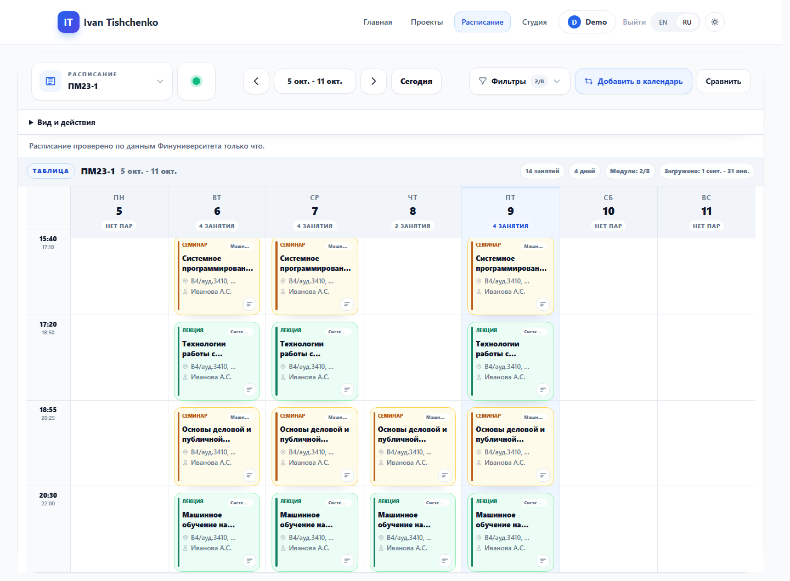
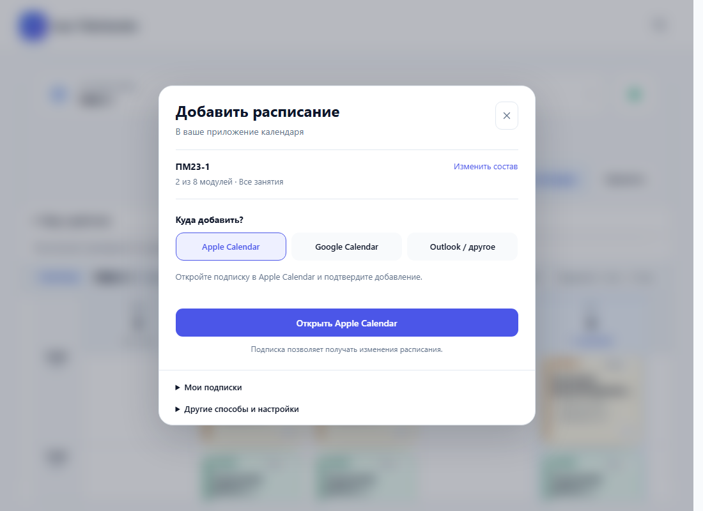
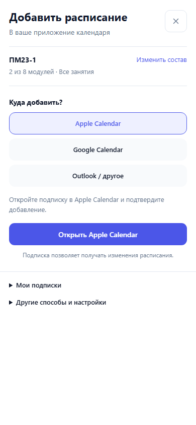

<div align="center">
  
  <h1>Matplobbot</h1>
  <p><a href="README.md">English</a> | <a href="README.ru.md">Русский</a></p>
  <strong>Учебные материалы, университетское расписание и создание документов — в Telegram и на сайте.</strong>

  <p align="center">
    
    
    
    
    
  </p>

  <p align="center">
    
  </p>

  <p><a href="https://ivantishchenko.ru/schedule">Расписание</a> · <a href="https://ivantishchenko.ru/studio">Студия документов</a> · <a href="https://github.com/Ackrome/matplobbot">GitHub</a></p>

  <h3>Открыть в Telegram</h3>
  <p align="center">
    <a href="https://t.me/matplobbot"></a>
    <a href="https://t.me/test_matplobbot"></a>
  </p>
</div>

## О проекте

Matplobbot объединяет учебные материалы, университетское расписание и создание документов в Telegram-боте и веб-приложении. Ищите конспекты, сравнивайте расписания, подключайте календарь и превращайте черновики в PDF в одном проекте.

Сайт поддерживает русский и английский языки, светлую и тёмную темы, компьютеры и мобильные устройства, а также Telegram Mini Apps. Ниже описаны возможности текущего репозитория; их доступность на работающем сервере зависит от установленной версии и настроек.

## Возможности

### Расписание и календари

- Поиск группы, преподавателя или аудитории в Telegram и на сайте. Управление поиском с клавиатуры, история, избранное и переход к сегодняшним занятиям.
- Фильтры по модулям и типам занятий, просмотр дня или недели, полные сведения о каждой паре.
- Отдельный рейтинг лояльности MyPrepod для каждого преподавателя пары: количество оценок и отзывов, профиль источника и дата проверки. Используется точное совпадение полного ФИО в Финансовом университете; отсутствие профиля и неоднозначные совпадения обозначаются явно.
- Сравнение до шести расписаний за период до 14 дней. Пересечения занятий и общие свободные окна на одной шкале. Отсутствующие данные не считаются свободным временем.
- Общие подписки для сайта и Telegram: ежедневное расписание и уведомления об изменённых, добавленных или отменённых занятиях.
- Подписка по приватной ссылке WebCal/iCalendar или разовая выгрузка ICS. Профили календаря позволяют задавать разные наборы расписаний и фильтров.
- Кнопка **Добавить в календарь** открывает отдельное окно выбора Apple Calendar, Google Calendar или Outlook. Здесь можно менять модули и управлять подписками, не сжимая расписание; на телефоне окно занимает весь экран.
- Просмотр сохранённых расписаний при недоступности источника с указанием свежести данных. Устанавливаемое веб-приложение также сохраняет оболочку интерфейса для офлайн-доступа.

### Студия документов

- Начните с локального черновика LaTeX, Markdown или Mermaid, а после входа сохраните его содержимое как проект.
- Редактируйте текст в Monaco, выбирайте шаблоны документов и презентаций с визуальными примерами, управляйте файлами, переименовывайте, копируйте и удаляйте проекты.
- Просматривайте Markdown и диаграммы во время редактирования, собирайте документы в фоне, скачивайте PDF/PNG или отправляйте результат в Telegram.
- Восстанавливайте черновики после перезагрузки страницы, сравнивайте локальную и серверную версии и скачивайте обе перед выбором.
- Переходите к файлу и строке из сообщения об ошибке. Просматривайте недавние сборки, повторно получайте результат или отменяйте текущую компиляцию.
- Загружайте несколько файлов с отдельным статусом для каждого и повторяйте неудачные загрузки. `Ctrl/Cmd+S` сохраняет, `Ctrl/Cmd+Enter` запускает сборку.

Черновики и последние 20 записей о сборках хранятся на текущем устройстве. Результаты сборок доступны до 24 часов: это помощь при восстановлении, а не постоянная история версий. Серверная компиляция требует подключения к сети.

### Учебные материалы и инструменты Telegram

- Просмотр и поиск тем `matplobblib` и Markdown-конспектов из подключённых репозиториев GitHub.
- Общий поиск по обоим источникам, сохранённые поисковые запросы и избранные материалы.
- Рендеринг формул LaTeX и диаграмм Mermaid в PNG, преобразование Markdown в HTML или PDF.
- Управление подписками, репозиториями, языком и личными настройками через меню бота.
- Дополнительная пересылка писем из личных ящиков IMAP/POP3 в Telegram: шифрование учётных данных, отдельное управление ящиками и повторные попытки доставки.

### Аккаунт и администрирование

- Страница аккаунта открывается по плашке с аватаром и именем. Здесь можно сменить язык и тему, вернуться к инструментам или перейти к настройкам Telegram.
- В аккаунте доступны сохранённые подписки на расписание и настройки уведомлений Telegram. Можно завершить текущую сессию или все сессии сайта; отзыв доступа сохраняется после перезапуска сервисов.
- Выгрузка данных аккаунта в JSON или ZIP с исходными файлами проектов. Удаление вынесено отдельно от повседневных действий и требует свежей выгрузки и подтверждения.
- Для администраторов доступны отдельные режимы состояния сервиса, использования и соответствий дисциплин модулям, а также страницы активности пользователей и экспорт CSV.
- Операционные показатели охватывают свежесть расписания, рендеринг и доставку уведомлений. Агрегированные метрики времени пользовательских сценариев не содержат текстов документов и поисковых запросов.
- Статистика обновляется через WebSocket. Если библиотека графиков недоступна, данные остаются в таблице.

## Интерфейс

Скриншоты расписания и календаря обновлены 9 октября 2026 года по текущему локальному интерфейсу с демонстрационными данными. Остальные снимки показывают Студию, аккаунт и состояние сервиса.

### Расписание на неделю

Компактные карточки держат название предмета, аудиторию и преподавателя рядом, сохраняя временную шкалу расписания.



### Подключение календаря

Выберите приложение календаря и нажмите основную кнопку. Окно открывается поверх размытого расписания, сохраняя его расположение; выбор модулей, сохранённые подписки и другие настройки раскрываются по необходимости. Подписка получает будущие изменения расписания, а скачанный файл ICS — разовая копия.



На телефоне тот же сценарий открывается на весь экран:

<p>
  
</p>

### Студия с просмотром Markdown и формул


### Аккаунт и состояние сервиса на телефоне

<p>
  
  
</p>

## Локальный запуск

Понадобятся Docker с Docker Compose v2 и токен Telegram-бота. Сборка сервисов использует базовые образы проекта из GHCR; Docker должен иметь возможность скачать их.

Серверный рендеринг требует изоляции worker через пространства имён Linux. Если Docker-хост использует AppArmor, перед запуском установите именованный профиль worker и добавьте Compose override по [инструкции выпуска](docs/release-runbook.md#acceptance-and-deployment). Docker Desktop без AppArmor не требует этого профиля. Если изоляция недоступна, рендеринг завершается отказом.

### 1. Скачайте репозиторий и настройте окружение

```bash
git clone https://github.com/Ackrome/matplobbot.git
cd matplobbot
cp .env.example .env
```

В PowerShell последнюю команду замените на `Copy-Item .env.example .env`. Перед запуском контейнеров отредактируйте `.env`:

| Переменная | Настройка |
| --- | --- |
| `BOT_TOKEN` | Токен вашего Telegram-бота. |
| `ADMIN_USER_IDS` | Telegram ID администраторов бота через запятую. |
| `POSTGRES_USER`, `POSTGRES_PASSWORD`, `POSTGRES_DB` | Учётные данные и имя базы данных. |
| `DATABASE_URL` | Обязательный URL SQLAlchemy с теми же учётными данными; внутри Compose имя хоста — `postgres`. Специальные символы в учётных данных необходимо URL-кодировать. |
| `REDIS_URL` | Внутри Compose: `redis://redis:6379/0`. |
| `JWT_SECRET_KEY` | Случайный секрет длиной не менее 32 символов. |
| `STATS_USER`, `STATS_PASS` | Отдельный парольный администратор и надёжный пароль; создайте аккаунт на шаге 3. |
| `PUBLIC_SITE_URL`, `CORS_ALLOWED_ORIGINS` | Для локального запуска оставьте значения localhost из шаблона; для сервера укажите свой публичный HTTPS-адрес. |
| `GITHUB_TOKEN` | Токен для функций GitHub, если они используются; иначе уберите пример значения. |
| `MAIL_CREDENTIAL_KEY` | Оставьте пустым, если пересылка почты не нужна. Иначе задайте действительный ключ Fernet и сохраняйте его между перезапусками. |

Для локальной разработки оставьте `ENVIRONMENT=development`. Полный шаблон также описывает журналирование, свежесть расписания, доставку уведомлений и операционные ограничения.

### 2. Запустите приложение

```bash
docker compose up --build -d main-site-frontend mpb-fastapi-stats mpb-scheduler
```

Compose также запустит необходимые бот, worker, базу данных, Redis и migrator. Migrator выполняет `alembic upgrade head`. Эта команда локального запуска не поднимает Caddy: его конфигурация в репозитории использует домены рабочего развёртывания.

Если сначала нужно собрать базовые образы локально:

```bash
docker build -f Dockerfile.base-python -t ghcr.io/ackrome/matplobbot-base-python:latest .
docker build -f Dockerfile.base-worker -t ghcr.io/ackrome/matplobbot-base-worker:latest .
```

### 3. Создайте парольного администратора

После запуска API-контейнера и завершения миграций базы данных:

```bash
docker compose exec mpb-fastapi-stats python -m fastapi_stats_app.bootstrap_admin
```

Команда читает `STATS_USER` и `STATS_PASS` из окружения контейнера. Она создаёт отдельного администратора или обновляет существующего администратора без привязки к Telegram, но отказывается перезаписывать обычный или Telegram-аккаунт. Публичная форма входа не создаёт этот аккаунт автоматически. В шаблоне используется имя `matplobbot-deploy`. Jenkins выбирает его через параметр `DEPLOY_ADMIN_USERNAME`, а пароль получает из секрета `PROD_STATS_PASS`; прежний секрет `PROD_STATS_USER` больше не используется. Если выбранное имя уже принадлежит обычному или Telegram-аккаунту, задайте другое имя для технического администратора.

На странице входа раскройте форму парольного входа администратора. Вход через Telegram дополнительно требует настройки бота и домена для вашего развёртывания; текущий фронтенд указывает на бота проекта. Перед настройкой собственного экземпляра изучите [документацию по авторизации и Mini Apps](docs/wiki.md#auth-and-account-sessions).

### 4. Откройте сервисы

| Сервис | Локальный адрес |
| --- | --- |
| Сайт | [localhost:8080](http://localhost:8080) |
| Расписание | [localhost:8080/schedule](http://localhost:8080/schedule) |
| Студия | [localhost:8080/studio](http://localhost:8080/studio) |
| Аккаунт и данные | [localhost:8080/account](http://localhost:8080/account) |
| Панель администратора | [localhost:8080/stats](http://localhost:8080/stats) |
| Интерактивная документация API | [localhost:9583/docs](http://localhost:9583/docs) |
| Состояние API | [localhost:9583/api/stats/health](http://localhost:9583/api/stats/health) |
| Состояние планировщика | [localhost:9584/health](http://localhost:9584/health) |

Фронтенд проксирует `/api/` и `/ws/` в FastAPI. В Telegram доступен бот, чей токен указан в настройках.

```bash
docker compose ps
docker compose logs -f mpb-telegram-bot mpb-fastapi-stats mpb-worker
docker compose down
```

Остановка сохраняет именованные тома базы данных и Redis. Рабочее развёртывание использует отдельные [docker-compose.prod.yml](docker-compose.prod.yml) и [deploy.sh](deploy.sh); подробности — в [документации по развёртыванию](docs/wiki.md#ci-deploy-and-wiki-sync).

## Команды Telegram

| Команда | Назначение |
| --- | --- |
| `/start`, `/help` | Знакомство с ботом и доступные команды |
| `/search`, `/search_presets` | Поиск по источникам и сохранённые поисковые запросы |
| `/matp_all`, `/matp_search` | Просмотр и поиск по библиотеке |
| `/lec_all`, `/lec_search` | Просмотр и поиск подключённых конспектов GitHub |
| `/schedule`, `/myschedule` | Поиск расписания или открытие объединённого личного расписания |
| `/plan`, `/conflicts`, `/free` | Сравнение расписаний, поиск пересечений и свободных окон |
| `/calendar_sync` | Управление календарными ссылками и профилями |
| `/studio` | Открытие студии документов |
| `/latex`, `/mermaid` | Рендеринг формулы или диаграммы |
| `/mail` | Настройка личной почты, если функция включена |
| `/favorites`, `/settings` | Избранные материалы и личные настройки |
| `/cancel` | Выход из текущего диалога бота |

## Архитектура

| Компонент | Назначение |
| --- | --- |
| `bot/` | Обработчики Aiogram 3, меню и доставка в Telegram |
| `main_site_frontend/` | Статическое приложение HTML/JavaScript, Tailwind CSS, оболочка PWA и прокси Nginx |
| `fastapi_stats_app/` | FastAPI: авторизация, расписание и календари, Studio, административные API и WebSocket |
| `scheduler_app/` | Обновление расписания, ежедневные уведомления, надёжные повторные доставки и проверка почтовых ящиков |
| `shared_lib/` | Модели SQLAlchemy, сервисы, задачи рендеринга, локализация и общая инфраструктура |
| `alembic/` | Миграции базы данных |
| PostgreSQL | Аккаунты, проекты, подписки, проиндексированные материалы и операционные данные |
| Redis + Celery | Кэши, состояние диалогов бота, фоновые задачи рендеринга и временные результаты |

Python-сервисы работают с PostgreSQL через SQLAlchemy/asyncpg. Worker содержит Pandoc, TeX Live, Mermaid CLI и инструменты браузерного рендеринга. Тяжёлая компиляция выполняется отдельно от процессов бота и API. Фронтенд загружает Monaco и библиотеки предпросмотра по необходимости.

Страница `/project` показывает README прямо из GitHub на выбранном языке сайта, очищает HTML, разрешает относительные ссылки и изображения и хранит локальную копию для каждого языка. Локальные изменения README появятся там после публикации в репозитории и обновления кэша страницы.

## Разработка и проверки

Используйте Python 3.11 или 3.12 и окружение `.venv` в корне репозитория. CI проверяет проект на Python 3.11, базовый Python-образ использует 3.12. Установите проект, зависимости сервисов и общие инструменты проверок в это окружение:

```bash
python -m venv .venv
```

Активируйте окружение командой `source .venv/bin/activate` в Linux/macOS или `.venv\Scripts\Activate.ps1` в PowerShell, затем выполните:

```bash
python -m pip install -e .
python -m pip install -r requirements.txt -r fastapi_stats_app/requirements.txt -r scheduler_app/requirements.txt
python -m pip install -r requirements-validation.txt
python -m ruff check . --select E9,F63,F7,F82
python -X utf8 -m coverage run --branch -m unittest discover -s tests -v
python -m coverage report --skip-covered
```

Чтобы пересобрать сохраняемый в репозитории CSS, установите Node.js/npm и выполните:

```bash
npm ci
npm run build:tailwind
```

`requirements.in` — редактируемый список зависимостей базовых образов, `requirements.txt` — файл с закреплёнными версиями. API, планировщик и инструменты проверок имеют отдельные списки. После изменения зависимостей следуйте [процедуре аудита](docs/wiki.md#dependency-audit) и актуальному [CI workflow](.github/workflows/ci-cd.yml).

GitHub Actions проверяет изменения, публикует общую библиотеку и проверяет четыре образа сервисов по digest на настоящих PostgreSQL, Redis, рендерере и восстановлении резервной копии. Jenkins развёртывает именно проверенные исходники и образы, сохраняет состояние для восстановления, применяет миграции и создаёт технического администратора. Релиз фиксируется как успешный только после smoke-тестов с авторизацией. См. [инструкцию выпуска и восстановления](docs/release-runbook.md) и [датированные результаты проверок](docs/reports/v1-release/README.md), включая ограничение отката к первой старой версии. Необязательные локальные хуки pre-commit настраиваются в [.pre-commit-config.yaml](.pre-commit-config.yaml).

При внесении изменений поддерживайте одинаковый набор ключей RU/EN, проверяйте затронутый сценарий и описывайте новую функциональность в `docs/wiki.md`. Для нового файла кода также нужен соседний `wiki_<filename>.md`, как указано в правилах проекта. Обновляйте обе языковые версии README вместе.

## Документация

- [Полная wiki возможностей](docs/wiki.md): сценарии, API, конфигурация и операционные правила.
- [Шаблон окружения](.env.example): поддерживаемые настройки и значения по умолчанию.
- [Заметки о реализации Studio](main_site_frontend/js/wiki_studio_workspace.md): восстановление, управление проектами и сборки.
- [Создание технического администратора](fastapi_stats_app/wiki_bootstrap_admin.md): настройка и обработка конфликтов аккаунтов.
- [План работ и принятые решения](docs/TODO.md): актуальные идеи вместе с историческими и отклонёнными пунктами.

## Лицензия

Matplobbot распространяется по [лицензии MIT](LICENSE).
