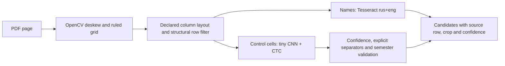
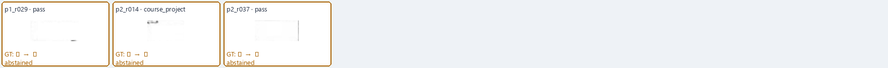

# Curriculum names + numeric CNN pipeline

Validated on 2026-10-09. Production scans now use this pipeline instead of the
legacy general-OCR control-cell parser. Native text PDFs retain their native path.

The [production rollout](production-rollout.md) on 2026-10-10 published the
reviewed 170 assessment records for all eleven verified ПМ23/ПМ25 groups.
It includes the public API/hash audit and the limits of timetable-title coverage.



Printed indices and headers are **not recognized**. The internal `scan:p1:r004`
identity denotes a physical row, not a curriculum index. Column meanings come
from a persisted, geometrically checked template; the 2023 and 2025 documents
have different control-column orders. Unknown documents require an explicit
layout declaration. No year/title guess or ground-truth lookup selects answers.

## Model and training boundary

- Four convolutional image blocks and temporal convolutional CTC head;
  **121,277 parameters, 488,345 ONNX bytes**, alphabet `0123456789,-`.
- Training: **384,000 procedurally generated examples**, 4,000 steps, batch 96,
  seed 419031. Installed fonts, scan noise, blur, skew and rule remnants; no PDF
  crops, OCR answers or curriculum GT were training inputs.
- Synthetic validation: 1,983/2,000 exact strings (99.15%). At confidence 0.90,
  1,968 accepted and 1,964 correct. Confidence is not a calibrated probability.
- CPU deployment through ONNX Runtime 1.23.2, one inference thread. Training used
  local CUDA; the server does not need CUDA, Torch, a model server or a GPU.
- Model SHA256:
  `88bc1d21d5cc709db75a17e2ef8cf2ffd695b0b8e6b22c3c40f6de4265bc8c01`.
- [Training metadata](../../../shared_lib/data/curriculum_numeric.json) records
  seeds, fonts and source hashes. Font files are not redistributed.
- [Exact training sources](training-sources.zip) preserve the generator and
  preprocessing bytes matching those historical hashes, before repository
  formatting. The archive includes their colocated maintenance documentation.
- [Export parity](export-parity.json): 256 new synthetic samples, zero decoded
  differences between PyTorch CPU and ONNX Runtime CPU; maximum logit error
  approximately 0.0000201.

The frozen model was scored separately from training. The 2023 document is a
development benchmark, not an untouched test set. The 2025 PDF has independent
native-text GT, but its geometry and wrapping cases informed pipeline rules.
It is a clean rasterized PDF, not a second independent noisy-scan benchmark.
These results do not establish universal accuracy.

## Full pipeline results

| Measure | 2023 scanned PDF | 2025 native PDF rasterized for this test |
|---|---:|---:|
| Physical rows audited | 91 | 102 |
| Discipline rows correctly identified | 66/66 | 76/76 |
| Discipline control cells | 330 | 380 |
| Correct accepted discipline cells | 327 | 380 |
| Abstained discipline cells | 3 | 0 |
| Nonempty discipline cells correctly read | 71/71 | 80/80 |
| Correct `(physical row, kind, semester)` facts | **79/79** | **89/89** |
| Strict facts also requiring exact normalized OCR name, local | **79/79** | **85/89** |
| Whole PDF, local CPU wall time | 7.48 s | 8.00 s |

Both production runs added **zero false control values to blank discipline
cells**. All 125/130 cells belonging to section/summary rows were intentionally
excluded before numeric recognition. Their counts must not become child-course
semesters; the all-row `abstentions` field in JSON therefore differs from the
discipline-only count above.

The three 2023 abstentions are blank cells with scan/rule artifacts:
`p1_r029/pass`, `p2_r014/course_project`, `p2_r037/pass`. The model did not invent
an exam or pass in any of them.



2025 strict-name errors: an extra opening quote in `p1_r026` (two facts), missing
«о» in «коллаборативная» in `p1_r046`, and `NLP` read as «МЕР» in `p2_r028`.
These are name OCR errors, not numeric-control errors. No GT-derived spelling
dictionary or automatic fuzzy substitution hides them.

Artifacts: [2023 scoring](pipeline-2023.json), [2025 scoring](pipeline-2025.json),
[frozen audit rows 2023](audit-rows-2023.json), [frozen audit rows 2025](audit-rows-2025.json).
GT lives in `tests/fixtures/curriculum_ocr`; indices retained in older audit
annotations are never inference inputs or matching requirements.

## Actual server measurement

app-vm has 8 virtual CPUs, 5 GiB RAM, x86-64-v2-AES without AVX/AVX2, and no GPU
passthrough. The host GTX 780 is not used. Temporary isolated user-directory
packages exercised the real production worker; system packages and production
services were not changed.

The complete two-page 2023 document takes approximately **28 seconds** and
**360 MiB peak process-tree RSS**, within the configured 1,536 MiB address-space
limit. All 79 numeric facts match the local run. Server Tesseract 5.3.4 makes one
name error («припожений» instead of «приложений»), so strict name-inclusive
matching is **78/79** there. See [the measured server report](server-benchmark.json)
for exact final timings, versions, hashes and comparison results.

The isolated numeric stage on 455 exported cells takes 0.54–0.60 seconds including
initialization, with about 73 MiB peak RSS. This is not the whole-PDF latency.
The test installed/extracted no packages globally and did not deploy the project.

## Preprocessing ablation and limits

Independent all-cell inference also ran on legacy exported crops, including
section totals. These inputs differ from production's tightly cut, deskewed,
grid-cleaned cells. They must not be substituted for pipeline metrics.

| Exported view | 2023 exact discipline cells | 2025 exact discipline cells |
|---|---:|---:|
| Cleaned, resized legacy export | 327/330 | 380/380 |
| Raw, grid remnants retained | 251/330 | 380/380 |

The raw 2023 run produces false numbers from rule remnants. Therefore the tiny
model is **not suitable as a generic raw-cell OCR service**: deskew, grid removal,
tight cropping, row filtering and validation are required parts of this pipeline.
All-row counts and errors, including section totals, remain in
`standalone-{2023,2025}-{clean,raw}.json`; no bad ablation run was discarded.

Wrapped cells are split geometrically into lines. A trailing comma or range mark
can join lines only when that separator is actually recognized and all line
confidences pass. `12` on one line and `34` on another are never silently changed
to `1,2,3,4`; low-confidence, malformed or out-of-range strings remain unresolved.

Layouts without these ruled columns, unshaded section styles or missing
department evidence need their own validated template/classifier. This pipeline
does not transfer section-level assessment counts to blank child cells. It
extracts explicit course-cell facts, not implied curriculum requirements.

## Reproduce and integrate

Run from the project root with UTF-8 enabled and scheduler OCR dependencies
installed. Tesseract needs `rus+eng`; use the existing environment override when
it is not on PATH. The inference command cannot receive GT.

```powershell
$env:PYTHONUTF8='1'
.venv/Scripts/python.exe -m scripts.run_curriculum_pipeline `
  --pdf C:/data/UP.pdf --scan-layout fa_legacy_v1 --output C:/runs/predictions.json
.venv/Scripts/python.exe -m scripts.evaluate_curriculum_numeric score `
  --predictions C:/runs/predictions.json --end-to-end `
  --gt tests/fixtures/curriculum_ocr/fa_pmo_2023_page1_gt.json `
       tests/fixtures/curriculum_ocr/fa_pmo_2023_page2_gt.json `
  --output C:/runs/score.json
```

Use `fa_compact_v1` and the `fa_pmo_2025_page*_native_gt.json` fixtures for the
2025 raster test. Source hashes must match. PDF hashes are recorded in every
score/audit file. Keep evaluation and training outputs separate.

Training command, including optional separate Torch/ONNX package directory:

```powershell
.venv/Scripts/python.exe -m scripts.train_curriculum_numeric `
  --output C:/runs/new-numeric-model --device cuda --steps 4000 `
  --package-path C:/path/to/training/site-packages
```

Do not overwrite the bundled weights during an experiment. Validate synthetic
quality, export parity and frozen real-document scores before explicitly copying
an ONNX/JSON pair into `shared_lib/data`. Source and model bytes participate in
the parser cache fingerprint, so an update queues cached documents again.

Production integration requires migration `fb1b2c3d4e5f`, the updated API and
scheduler image. Wheel packaging contains both model assets; the scheduler build
instantiates the recognizer as a smoke check. `PUT /api/curricula/{id}/scan-layout`
stores an explicit template and queues reprocessing while preserving publication.
Stale jobs cannot overwrite a newer source/layout, including A→B→A changes.

Recognition remains outside HTTP requests in the existing bounded background
worker. Extraction fills candidates automatically; existing source registration,
group binding and publication are separate. No deployment or publication was
performed as part of this validation.

## Repository checks

Final full suite: **563 tests, 562 passed, one optional local legacy-scan test
skipped**, branch coverage report 63%. Critical Ruff checks, workflow YAML parsing,
colocated wiki coverage and `git diff --check` passed. Migration upgrade/downgrade
ran against an isolated SQLite database. Package assets and the recognizer
constructor were verified from a separately extracted wheel; an actual Docker
image build was unavailable because the daemon was inaccessible in that probe.
All nine measured runtime-file hashes are preserved in the server report. The
subsequent publication work fixes the separate native parser's parent-section
hierarchy; do not replace the historical benchmark hashes with newer source
hashes. The project graph was rebuilt with UTF-8.
