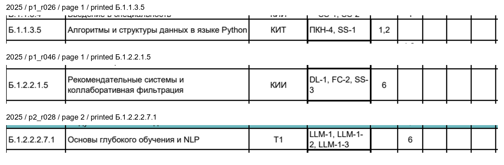
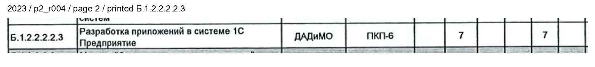
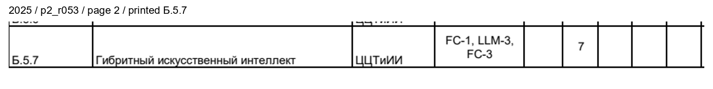
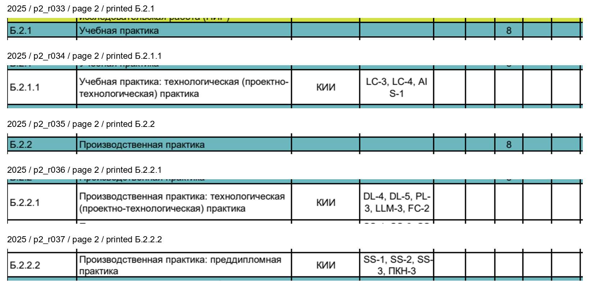

# Reviewed publication records

Prepared and source-checked on 2026-10-09. These files are review artifacts;
creating them did not write to the production database or create group bindings.
Each `publish-*.json` is a publication request body containing `expected_hash`
and `assessments`. Every assessment has exactly the six fields accepted by
`validate_assessments`: code, name, semester, kind, page and evidence.

| Plan | Ready payload | Records | Exams | Passes | Graded passes | Coursework | Course projects |
|---|---|---:|---:|---:|---:|---:|---:|
| 2023–2027 | [publish-2023.json](publish-2023.json) | 79 | 30 | 46 | 1 | 1 | 1 |
| 2025–2029, updated official version | [publish-2025.json](publish-2025.json) | 89 | 30 | 55 | 2 | 0 | 2 |

Both payloads pass the production publication validator. Comparison with the
independent references has zero missing and zero additional facts, requiring
the physical source row, exact source title, assessment kind and semester.
Blank cells remain blank. No course receives a parent section's assessment.
These are explicit planned assessments, not dated examination-session events.

## Sources and versions

The 2023 source is the [official scanned plan](https://www.fa.ru/upload/constructor/773/o1glti47zsriv5zhc7qc6agt7g6gou7x/UP.pdf),
SHA256 `73d6fa541ce75445d21d3e6ed810ee532954959056f6d9cf314e0f84fcd94bf3`,
two pages. The payload uses the reviewed local scan-pipeline output, retaining
`scan:p1:r004`-style physical row identities. The document repeats one printed
course code for two different courses; replacing these physical identities with
printed codes would lose that distinction. Printed source codes and normalized
page coordinates remain in [2023 provenance](publication-provenance-2023.json).

The 2025 source is the [updated official native-text plan](https://www.fa.ru/upload/constructor/e13/mm7ghxp0y1dumv3ons4kyeey1qy0haj1/uchebnyy-plan-PMO_2025-new.pdf),
SHA256 `26aa4732da0efe213f5e2426ce63c85c04ab15a854c1542c4264d5d4c9239b86`,
three pages. Its direct university publisher is the
[Financial University Centre for Artificial Intelligence](https://www.fa.ru/university/structure/scientific-educational-departments/itabd/centrai/).
The payload uses native PDF text and printed course codes, avoiding unnecessary
OCR errors. [2025 provenance](publication-provenance-2025.json) gives the exact
source row, literal control-cell text and coordinates for every published fact.

The general catalog also links a
[signed 2025 scan](https://www.fa.ru/upload/constructor/07f/6hoeielk52accyytn19mbnfs6jtxfcl4/uch_plan_PMiI-OP-PMO_PMO_25.pdf),
SHA256 `4de019ce8ffd0ec18abfad63a199e2417b8bf55b509ab97e55ac25d07f65556f`.
Visual inspection finds the study seminar on page 2 and an empty elective
section followed by a note that electives are defined by local university acts.
The updated native plan contains seven named elective rows, including
«Математика искусственного интеллекта», which is present in the current ПМ25
timetable. These PDFs are distinct versions; this review does not claim they
have identical contents. The signed scan produced no supported ruled-table
rows in the current pipeline, so it is not an alternative quality benchmark or
the source of the 89-record payload.

## Verified names

The following OCR spellings were checked against the actual rendered PDF rows.
The frozen benchmark output and its measured error rates remain unchanged.
Publication uses the verified source spelling; no model weights, fuzzy
dictionary or numeric predictions were changed by this review.

| Source row | OCR result | Source spelling | Facts affected |
|---|---|---|---:|
| 2023 p2_r004, server Tesseract only | Разработка припожений в системе 1С Предприятие | Разработка приложений в системе 1С Предприятие | 1 |
| 2025 p1_r026 | ‘Алгоритмы и структуры данных в языке Python | Алгоритмы и структуры данных в языке Python | 2 |
| 2025 p1_r046 | Рекомендательные системы и кллаборативная фильтрация | Рекомендательные системы и коллаборативная фильтрация | 1 |
| 2025 p2_r028 | Основы глубокого обучения и МЕР | Основы глубокого обучения и NLP | 1 |

The local 2023 output already has the correct title. The 2025 publication is
native extraction, whose source text also has the correct titles.

The printed 2025 elective title is «Гибритный искусственный интеллект». This is
a typo in the source itself, not an OCR error; the source spelling is preserved.

## Why the native parser previously returned 91 records

The extra records were page 2 section rows `Б.2.1` «Учебная практика» and
`Б.2.2` «Производственная практика», each with a graded-pass cell containing
`8`. Their actual child discipline rows have blank assessment cells.
The old parser built the parent hierarchy only from rows already containing
assessment candidates. Blank children disappeared before that check, causing
their parent sections to be mistaken for disciplines.

The corrected parser collects every valid source code in geometrically
validated tables before assessment filtering, including blank children and
codes on other pages. It then excludes parent codes. On the same source it
returns **89 records**, without transferring either grade to child disciplines.
Two synthetic regression tests cover blank children, the all-blank result and
the distinction between descendants of `B2.1` and adjacent code `B2.10`.
The document-parser suite passes all 17 tests.

## Timetable coverage and unresolved names

[The timetable comparison](publication-title-coverage.json) checks all eleven
ПМ23/ПМ25 groups collected by the group-verification task. It retains only group
identifiers, discipline titles and snapshot hashes, without lecturer details.
The comparison is title coverage across the published plan, not a claim that
every title has an assessment in the currently displayed semester.

- ПМ23: 14 of 17 distinct timetable titles match a published source title.
  «Машинное обучение на графах» and «Технологии и алгоритмы анализа сетевых
  моделей» are absent from this 2023 source. They must not be guessed from a
  similarly named course or from the 2025 plan.
- ПМ25: 11 of 13 distinct titles match. «Практическая подготовка» omits the
  course number, while the source has separate first-, second- and third-year
  electives. The title alone is insufficient to select one.
- Both cohorts contain «Военная подготовка», while the plan says «Основы
  военной подготовки». This spelling similarity alone does not prove identical
  course scope or assessment timing. No alias was added by this review.

Group binding, semester dates, registry creation and deployment are separate
operations performed by the main task using the independently verified cohort
evidence. The publication payloads contain no inferred group associations.

## Current BRS supplement

Further official-source research found the Department of AI's bachelor BRS for
autumn 2026/27. [Evidence and source hash](group-binding/supplemental-brs-evidence.json)
and the inspected page images establish a pass for «Машинное обучение на графах»
(page 13, title omits «на», corroborated by its author and RUZ lecturer) and
«Технологии и алгоритмы анализа сетевых моделей» (page 35). Numbered semester 7
comes from the verified current ПМ23 schedule, not from the BRS phrase “first
semester studying this discipline”.

[publish-2023-brs.json](publish-2023-brs.json) retains these two facts separately.
The BRS is registered as a supporting document linked to the 2023 curriculum;
its own 41-page snapshot supplies the displayed evidence links. The base
79-record curriculum payload and its benchmark results remain unchanged.
With the supplement, 16/17 current ПМ23 titles have verified assessment data.
Military training and the ambiguous ПМ25 practical-training label remain
unconfirmed; no similar-title substitution supplies their forms.

`publication-bundle.json` combines all three documents and the eleven verified
group bindings. Source PDFs are staged beside it under `sources/` for the CLI;
they are not embedded in the repository JSON. Every staged PDF must match its
recorded SHA before any authenticated API writes begin. The CLI's colocated wiki
documents dry-run/apply, backups, idempotency and failure handling.
