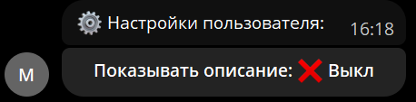
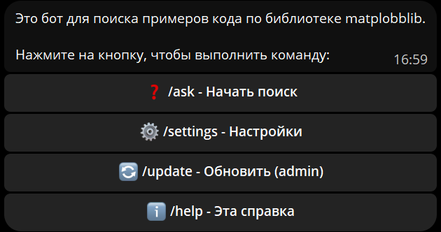
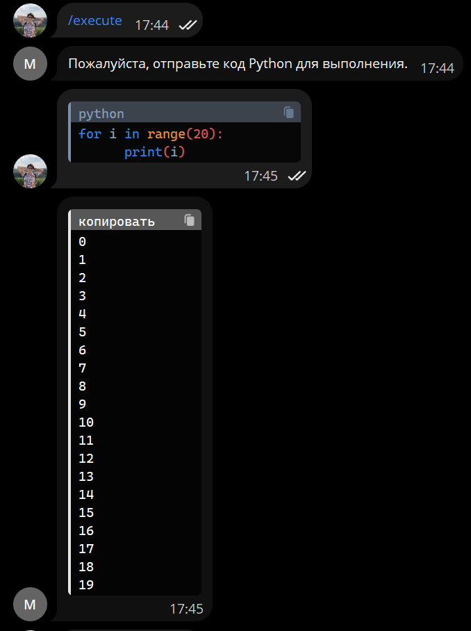
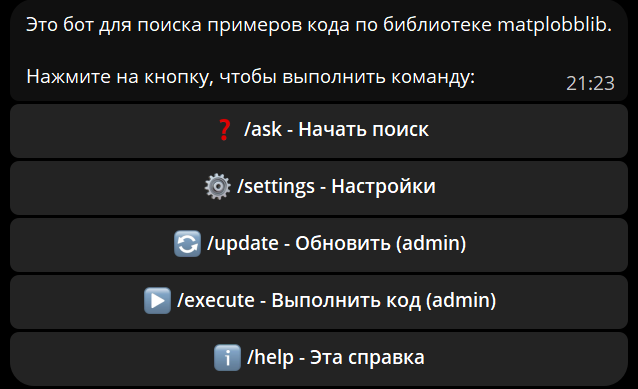
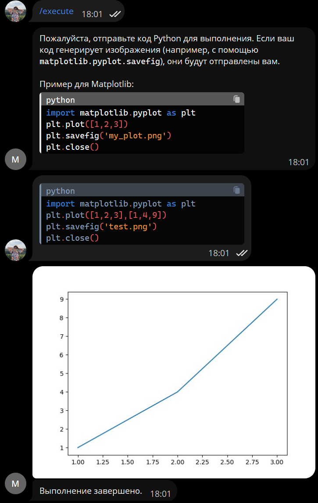
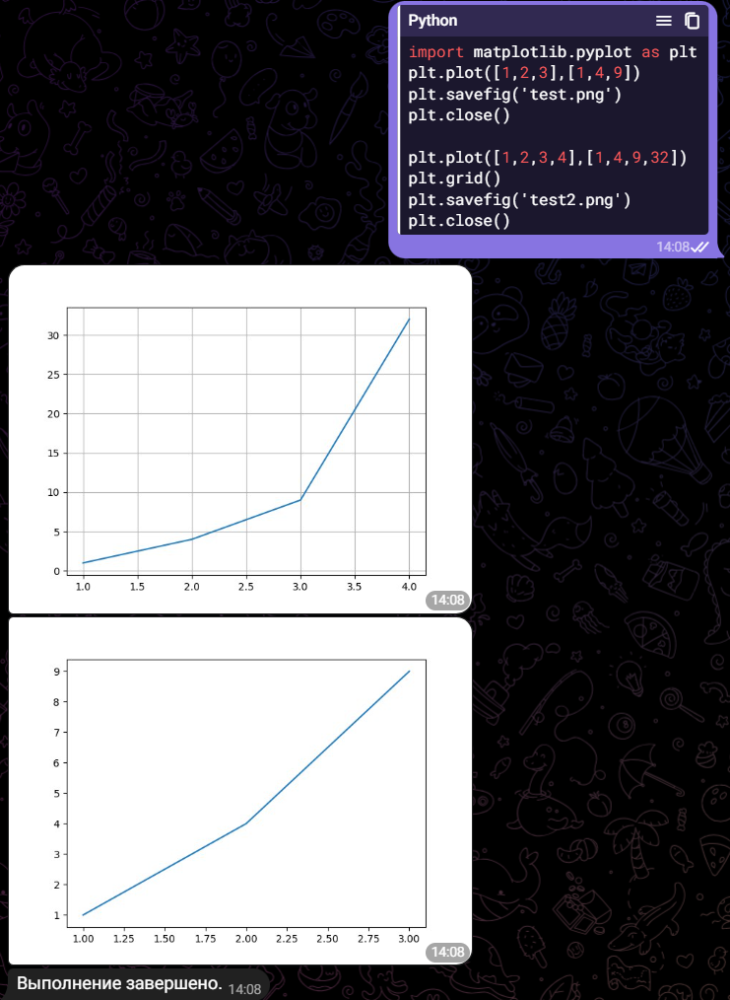
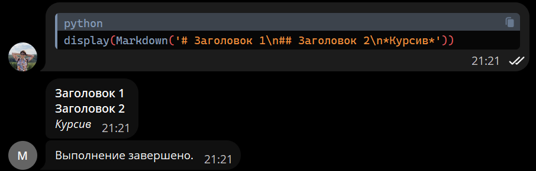
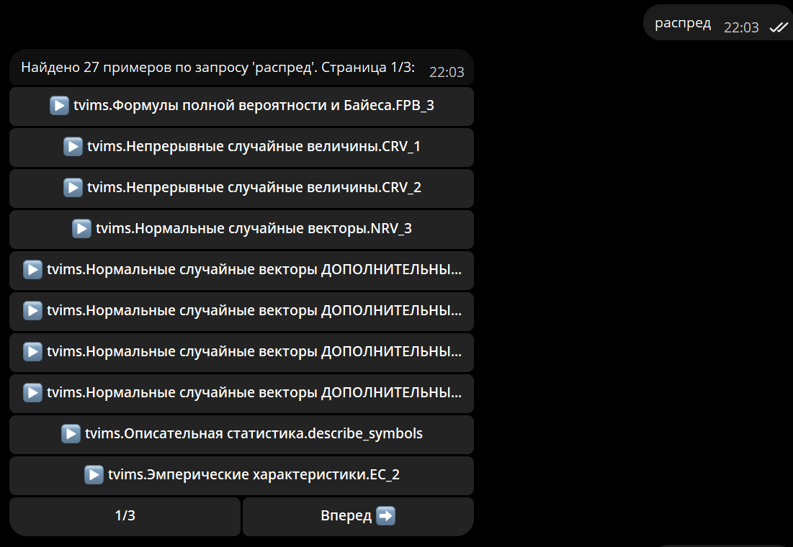

# 0.1.0

Начинаем вести журнал обновлений версии

Также добавлен функционал из библиотеки [matplobblib](https://github.com/Ackrome/matplobblib), а точнее из релиза [0.3.0](https://github.com/Ackrome/matplobblib/releases/tag/v0.3.0). Теперь по команде `/settings` пользователь выбирает, нужно ли ему ваыводить docstring запрашиваемого кода.

Сообщение меняется взависимости от выбранных настроек.

# 0.1.2

Добавлена Inline клавиатура для help. Теперь админ команды показываются только админу

# 0.1.3

Добавлена команда `/execute`, позволяющая администратору запускать код на python внутри бота

# 0.1.4

Обновлена команда `/help` теперь она выводит весь список доступных пользователю команд

Не администратору не выводятся команды с подписью (admin)

# 0.1.5

Теперь, если код в `/execute` сохраняет файл в формате изображения, то бот выдаст это изображение.

Причем выдаст все изображения, создаваемые кодом:

# 0.1.6

Добавлена поддержка Markdown Разметки вывода:

# 0.1.7

Добавлена возможность поиска по всем функциям библиотеки:

Если найдено больше 10 вариантов, то показывается пагинация:

# 0.1.8

Добавлена возможность добавлять найденные через `/ask` и `/search` функции в избранное.

